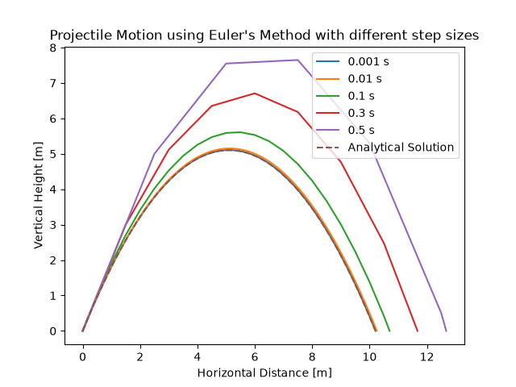
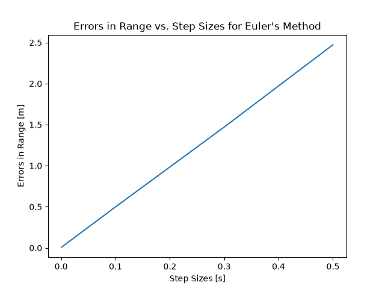
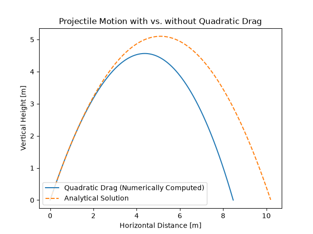

# Projectile Motion Simulation

A Python project exploring computational physics through the numerical simulation of projectile motion. Euler's Method is used to solve the equations of motion for both ideal projectile motion and a model incorporating quadratic air resistance.



## Motivation

Projectile motion provides a simple introduction to computational modeling because the underlying physics can be described using differential equations. The ideal projectile case has a known analytical solution, allowing numerical methods to be validated. Adding aerodynamic drag creates a more realistic system that requires numerical simulation.

This project explores how physical assumptions and numerical methods influence the predicted behavior of projectile motion.

## Mathematical Model

The projectile is represented by the state vector:

$$
\mathbf{s} =
\begin{bmatrix}
x \\
y \\
v_x \\
v_y
\end{bmatrix}
$$

The second-order equations of motion are rewritten as a coupled system of first-order differential equations so they can be integrated numerically using Euler's Method.

For ideal projectile motion:

$$
\frac{dx}{dt}=v_x
$$

$$
\frac{dy}{dt}=v_y
$$

$$
\frac{dv_x}{dt}=0
$$

$$
\frac{dv_y}{dt}=-g
$$

The drag model introduces a quadratic air resistance force:

$$
\mathbf{F}_d=-\frac{1}{2}C_d\rho A|\mathbf{v}|\mathbf{v}
$$

which produces accelerations

$$
a_x=-\frac{c}{m}|\mathbf{v}|v_x
$$

$$
a_y=-g-\frac{c}{m}|\mathbf{v}|v_y
$$

where

$$
c=\frac{1}{2}C_d\rho A
$$

combines the aerodynamic constants into a single drag parameter.

## Numerical Method

The equations of motion are solved using Euler's Method:

$$
\mathbf{s}_{n+1}=\mathbf{s}_n+\Delta t\frac{d\mathbf{s}}{dt}.
$$

Because Euler's Method evaluates the derivative only at the beginning of each timestep, it approximates the solution using a local linear approximation. This produces a local truncation error of $O(\Delta t^2)$ and an accumulated global error of $O(\Delta t)$. Consequently, the overall simulation error is expected to scale linearly with the timestep size, which is confirmed by the results.

To improve the accuracy of the estimated range, the impact location is determined by linearly interpolating between the final point above the ground and the first point below it.

## Results

### Numerical Error



The range error increases linearly with timestep size, consistent with the first-order convergence expected from Euler's Method.

### Quadratic Drag



Including quadratic air resistance produces a shorter range and lower maximum height than the ideal model. Because this system has no simple closed-form solution, it must be solved numerically.

## Key Findings

* Euler's Method accurately reproduces the analytical solution for ideal projectile motion as the timestep size decreases.
* The range error exhibits a linear relationship with timestep size, demonstrating the first-order convergence of Euler's Method.
* Introducing quadratic air resistance significantly reduces both the projectile's maximum height and horizontal range, illustrating the influence of aerodynamic drag.

## Project Structure

```text
Projectile_Motion/
├── main.py           Runs the simulations and generates plots
├── physics.py        Defines the equations of motion
├── solvers.py        Implements numerical integration methods
├── analysis.py       Performs interpolation and error analysis
├── requirements.txt  Lists project dependencies
└── README.md         Project documentation
```

## Requirements

* Python 3
* NumPy
* Matplotlib

## Running the Project

### 1. Clone the repository:

```bash
git clone https://github.com/rohitkb7782/Projectile_Motion.git
cd Projectile_Motion
```

### 2. Install the required dependencies:

```bash
pip install -r requirements.txt
```

### 3. Select the Projectile Model

Before running the simulation, open `main.py` and choose which projectile model you would like to simulate by changing the `model` variable.

- To simulate **ideal projectile motion** (without air resistance), set:

```python
model = "ideal"
```

- To simulate **projectile motion with quadratic drag**, set:
```python
model = "drag"
```
Make sure the correct model is selected before running the program, depending on which simulation you want to analyze.

### 4. Run the simulation:

```bash
python main.py
```

Running `main.py` will generate the trajectory plots for the selected model and display the corresponding range estimates and error analysis results.

## Future Improvements

* Implement higher-order integration methods such as Runge-Kutta (RK4)
* Compare multiple numerical integration methods
* Add wind forces
* Model gravity variation with altitude

## Conclusion

This project explored how numerical methods can be used to model physical systems governed by differential equations. By starting with ideal projectile motion and extending the model to include quadratic air resistance, the simulation demonstrates how mathematical assumptions and numerical techniques influence the behavior of a system. The modular structure allows the same framework to be adapted to more complex physical simulations.
